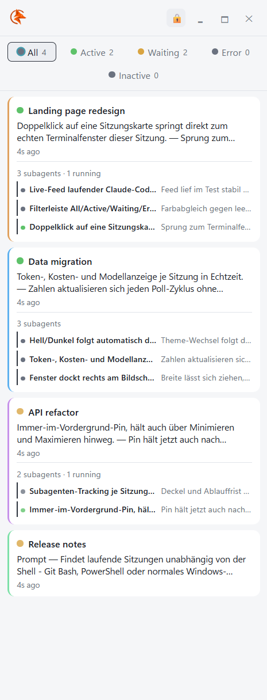
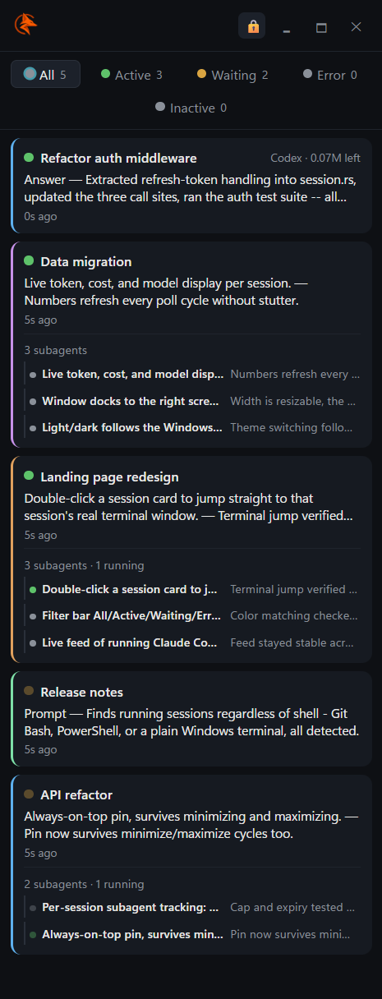

# AI Session Buddy

A narrow, always-on-top desktop widget for Windows that shows what your running
[Claude Code](https://claude.com/claude-code) sessions are doing right now — prompts,
tool calls, subagents, questions waiting on you, tokens left — as a live vertical feed,
one card per event.

<p align="center">
  <table align="center">
    <tr>
      <td align="center"><br><sub>Light</sub></td>
      <td align="center"><br><sub>Dark</sub></td>
    </tr>
  </table>
</p>

It reads only local, already-on-disk state that Claude Code itself writes: the live
process registry (`~/.claude/sessions/*.json`) and the session transcripts
(`~/.claude/projects/*/*.jsonl`, including subagent transcripts). Nothing is sent
anywhere, nothing is written back. No daemon, no hooks, no config file.

This format is internal to Claude Code and not a documented, stable contract — parsing
is defensive on purpose (see `monitor.py`), and expect drift across Claude Code versions.

## Requirements

- Windows, Python 3.11+
- The Microsoft Edge WebView2 runtime (already installed on current Windows 10/11)
- ~250 MB RAM (WebView2 window, comparable to 2–3 browser tabs)

## Setup

```
pip install -r requirements.txt
```

## Run

```
pythonw -m claude_session_feed
```

(`pythonw` instead of `python` so no console window opens alongside the widget.)

## Self-check

```
python test_monitor.py
```

Runs the classifier against a synthetic transcript and asserts the expected blocks
come out the other end — no live session required.

## Current scope

- Shows every running Claude Code session on the machine, not just one project.
- Ended sessions stay visible for 10 minutes, then drop out of the feed.
- Waiting permission prompts are invisible in the transcript, so a tool card just says
  "running for Ns" without knowing whether it's actually blocked on you.

## License

[MIT](LICENSE)
